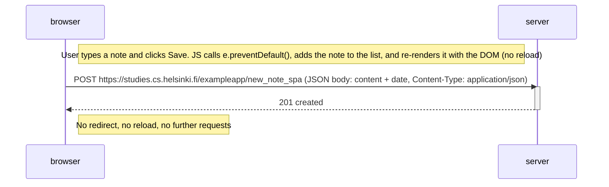

# 0.6: New note in Single page app diagram

Sequence of events when a user creates a new note in the single page app.
The page is already loaded (see 0.5) and never reloads, so this is a single POST.

