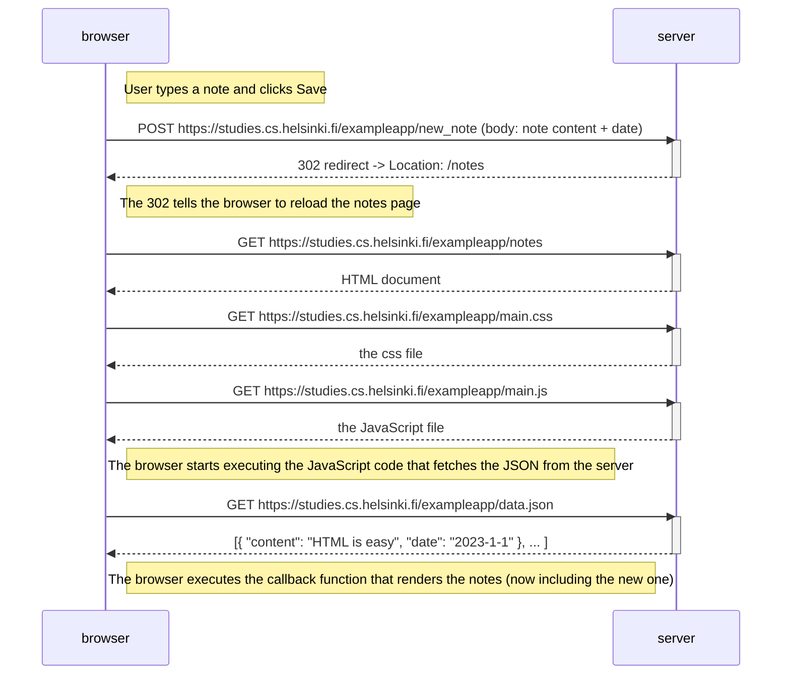
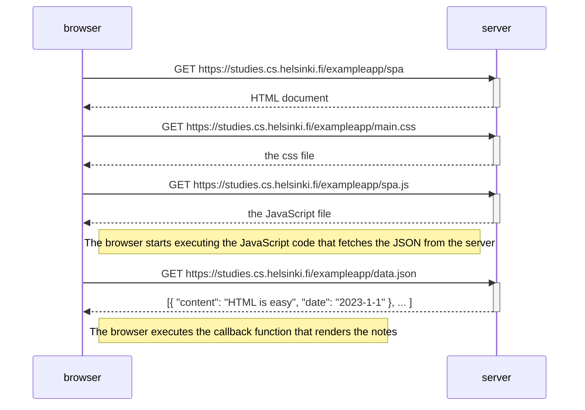
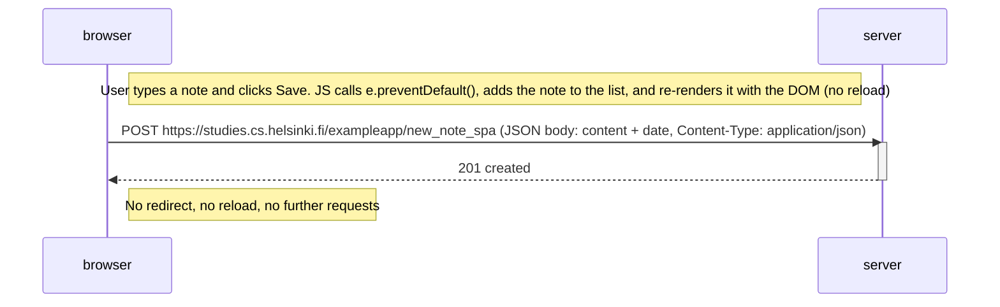

# Part 0 - Fundamentals of Web Apps

Exercises 0.4 - 0.6. Exercises 0.1 - 0.3 are reading only and not submitted.

## 0.4: New note diagram

Sequence of events when a user creates a new note on the traditional page
`https://studies.cs.helsinki.fi/exampleapp/notes`.

## 0.5: Single page app diagram

Sequence of events when a user opens the single page app at
`https://studies.cs.helsinki.fi/exampleapp/spa`.

## 0.6: New note in Single page app diagram

Sequence of events when a user creates a new note in the single page app.
The page is already loaded (see 0.5) and never reloads, so this is a single POST.

